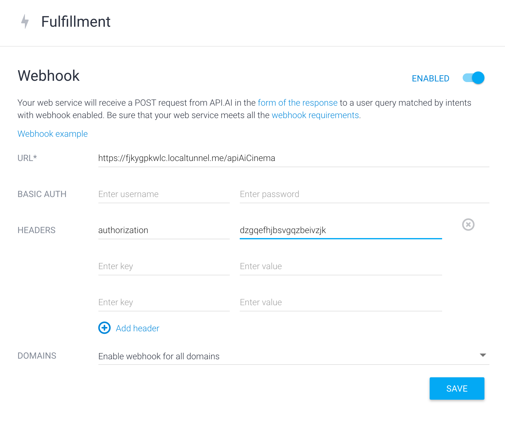

This project allow you to catch web hook from [api.ai](https://api.ai/) when a request is triggered 
on you agent, the server process the result to send back the response and let your assistant speech it.

For the authentication part, when the user is authenticated with google OAuth2, The middleware catch the request
to create the user locally if is not already created.

 ### How it works
 
- To run lint and fix `npm run lint`
- To run tests suite `npm run test`
- Start the server `npm start`
- To run up/down migration `npm run migrate {up/down}`

### Configuration

To configure put all config file in the `./src/config/*`.
To use the env variable, remove `.demo` from `.env.demo`.

### WebHook from [api.ai](https://api.ai/)

To receive a callback from [api.ai](https://api.ai/), you must enabled webhook in `Fullfillment` tab and fill all information needed.
To see how it works locally, you need to activate a local tunnel using the following url
 
- `GET http://localhost:3000/localTunnelStart` to start it
- `GET http://localhost:3000/localTunnelStop` to close it

The local tunnel url returned need to be write in the `url` section with the path to the webHook which is actually `/apiAi`

After to be logged in your app you should give you `token` access in the `headers` section : `authorization ...`
Then, active `Fullfillment` in the targeted intent.



After that, to connect your agent to actions on google, go to `Integration` part and active actions on google.
Then configure it to access `OAuth2` authentication with google. (Look `google cloud platform` to manage you OAuth settings).

After [api.ai](https://api.ai/) received request, you should received a callback as the following result :
```json
{
    "source": "agent",
    "resolvedQuery": "quelle est la météo",
    "action": "weather",
    "actionIncomplete": true,
    "parameters": {
      "address": "",
      "date-time": ""
    },
    "contexts": [
        {
            "name": "weather_dialog_context",
            "parameters": {
                "date-time.original": "",
                "address": "",
                "date-time": "",
                "address.original": ""
            },
                "lifespan": 2
            },
            {
            "name": "db44589c-29e2-447c-8368-94503e3ccae9_id_dialog_context",
            "parameters": {
                "date-time.original": "",
                "address": "",
                "date-time": "",
                "address.original": ""__
            },
            "lifespan": 2
        },
        {
            "name": "weather_dialog_params_address",
            "parameters": {
                "date-time.original": "",
                "address": "",
                "date-time": "",
                "address.original": ""
            },
            "lifespan": 1
        }
    ]
}
```

And then, the result is sent to the run method of the service `jeeves` endPoint which manage the rest of the process.

And when the process is done, a response is generate to be send to the `api.api`.